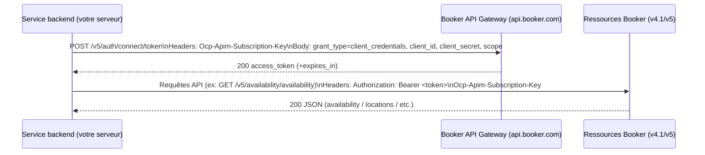
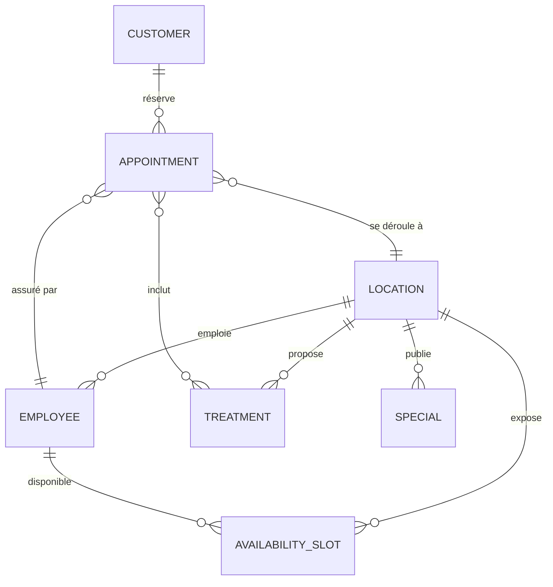

# API Booker et écosystème MINDBODY : existence, accès, authentification et intégration

## Synthèse exécutive

Une API existe bien pour Booker dans l’écosystème MINDBODY, mais elle apparaît sous plusieurs “couches” et portails, avec des niveaux d’ouverture différents. D’un côté, le portail développeurs MINDBODY affiche explicitement une documentation “Booker API” et décrit un parcours d’accès (compte développeur, environnement de staging, demande de “go live”). citeturn15search12turn10search1 De l’autre, un portail développeur dédié à Booker (hébergé sur un portail Azure API Management) existe au moins en environnement “Staging” et impose une connexion. citeturn15search10turn13search16 L’existence d’une documentation “méthode par méthode” sur developers.booker.com est confirmée par des bibliothèques clientes communautaires (notamment Ruby), qui indiquent aussi des versions d’API (v4.1, v5) et une migration hors v4. citeturn16view0turn34search0

Sur le plan technique, les éléments les plus robustes et vérifiables publiquement (sans accès au portail privé) montrent un modèle d’API “gateway” typique : en-tête de clé d’abonnement `Ocp-Apim-Subscription-Key` + jeton `Bearer` (JWT) obtenu via OAuth2 (flux client_credentials et refresh_token documentés dans un client Ruby). citeturn36view0turn36view4turn36view2 Un flux OpenID Connect/OAuth2 “authorization code” pour obtenir des jetons utilisateur/merchant est également observable côté identité (endpoints `/auth/connect/authorize` et `/auth/connect/token` sur un domaine d’identité Booker, avec scopes `openid … offline_access merchant`). citeturn21view0turn16view1

En matière d’accès et de coûts, une tarification “au call” est documentée côté support (Booker API = mêmes frais que Mindbody API ; gratuit sous un seuil, puis facturation au-delà). citeturn10search3turn13search7 Les conditions d’usage API officielles MINDBODY (mise à jour 30/09/2023) encadrent strictement la confidentialité, les limitations d’appels, la facturation, et imposent notamment des restrictions de cache (ex. “pas plus de 48h”). citeturn37view0 Les questions de conformité (données personnelles, paiements, etc.) doivent être traitées comme centrales : la politique de confidentialité MINDBODY (mise à jour 28/07/2025) confirme que des catégories sensibles et financières peuvent transiter via les services (selon le contexte). citeturn38view0

## Cartographie des APIs et portails officiels

Le paysage “Booker + MINDBODY” se comprend mieux en distinguant (a) les portails et (b) les familles d’API.

Côté portails, trois points d’entrée ressortent :

- Portail développeurs MINDBODY (documentation et ressources) qui liste les APIs (Public API, Webhooks, etc.) et publie des ressources “officielles” (release notes, termes, endpoints). citeturn11view1turn12view0  
- Documentation “Booker API” sur le même portail (parcours d’accès, staging, go-live). citeturn15search12turn13search2  
- Portail dédié Booker en mode “API Portal (Staging)” (portail Azure API Management) avec “Sign up/Sign in”, et mention “Powered by Mindbody”. citeturn15search10turn13search16  

Côté familles d’API, l’écosystème MINDBODY documente des domaines “Business data” (rendez-vous, clients, ventes, sites/locations, staff) via sa Public API, complétés par Webhooks (push events) et d’autres APIs spécialisées (Affiliate, Consumer). citeturn11view1turn8search8turn11view2 L’API Booker (au sens “Booker product”) ajoute un jeu d’endpoints spécifiques (v4.1/v5 dans les intégrations observables publiquement), orientés réservation/availability/online booking et fonctions merchant. citeturn29view0turn22view3turn32view0  

Tableau de synthèse (ce qui est vérifiable publiquement sans login au portail Booker) :

| Domaine | Indice public fort d’existence | Portail/docs | Notes |
|---|---|---|---|
| Booker API (product) | Portail Booker “API Portal (Staging)” + librairies clientes mentionnant une doc developers.booker.com et versions v4.1/v5 | apidoc.booker.com (staging), developers.booker.com (mentionné) citeturn15search10turn16view0 | Docs complètes vraisemblablement derrière login |
| Mindbody Public API + Webhooks | Endpoints “business data elements” + release notes mensuelles | developers.mindbodyonline.com (endpoints, release notes) citeturn11view1turn12view0 | Base contractuelle et de gouvernance API claire |

## Authentification et autorisation

### Booker API : modèle “subscription key + Bearer token”

Les preuves les plus concrètes côté Booker (accessibles publiquement) proviennent d’un client Ruby communautaire qui encode la mécanique d’accès :

- Les appels API utilisent `Authorization: Bearer <access_token>` **et** `Ocp-Apim-Subscription-Key: <subscription_key>` dans les headers. citeturn36view0  
- Le jeton s’obtient via un endpoint `POST /v5/auth/connect/token` (content-type `application/x-www-form-urlencoded`) avec `grant_type`, `client_id`, `client_secret`, `scope` (et éventuellement `refresh_token`). citeturn36view4turn36view0  
- Les scopes de jeton acceptés incluent au moins `public`, `merchant`, et des scopes plus spécialisés (ex. `parter-payment`, `internal` dans la liste interne du client). citeturn36view4turn16view0  
- Il existe une notion de “contexte” (probablement multi-location/multi-merchant) via `POST /v5/auth/context/update` avec un paramètre `locationId`. citeturn36view4turn36view0  

Ces indices sont cohérents avec un déploiement derrière Azure API Management (la clé d’abonnement `Ocp-Apim-Subscription-Key` étant l’en-tête par défaut documenté par Azure APIM). citeturn15search2turn15search7  

### Booker Identity : flux OpenID Connect / OAuth2 “authorization code”

Pour des scénarios où un utilisateur/merchant consent et où l’on récupère un couple access_token/refresh_token, une stratégie OmniAuth montre :

- Base d’identité par défaut (sandbox) et base de prod paramétrable (ex. `https://signin.booker.com`). citeturn16view1turn21view0  
- Endpoints d’autorisation et de token : `/auth/connect/authorize` et `/auth/connect/token`. citeturn21view0  
- Scopes typiques : `openid profile userinfo offline_access merchant`. citeturn16view1turn16view1  
- Le token d’accès est un JWT (décodé côté client pour extraire `sub`, `location_id`, rôles, etc.). citeturn21view0turn16view1  

### Mindbody : OAuth2 (Public API), API keys (Webhooks), Basic+API-Key (Affiliate)

Pour comparaison (utile si votre intégration Booker doit aussi “s’aligner” sur les patterns MINDBODY) :

- OAuth2/Identity MINDBODY (Public API) : endpoints `https://signin.mindbodyonline.com/connect/authorize` et `https://signin.mindbodyonline.com/connect/token`, scope de type `email profile openid offline_access Mindbody.Api.Public.v6` (avec variantes dev). citeturn11view3  
- Webhooks : authentification par `API-Key` header (pas d’Authorization requis dans l’extrait consulté), et l’objectif est de réduire le polling via des notifications push. citeturn8search8  
- Affiliate API : `API-Key` + `Authorization: Basic <base64(clientKey:clientSecret)>`, avec HTTPS/TLS 1.2+ et recommandation explicite de ne pas stocker les clés côté mobile/front. citeturn11view2  

### Diagramme Mermaid : flux Booker “client_credentials” (machine-to-machine)



citeturn36view4turn36view0turn22view3turn16view0  

## Ressources et endpoints clés

### Booker API : endpoints observables (v4.1 customer/merchant + v5 availability)

Sans accès au portail Booker authentifié, la meilleure source “d’énumération” d’endpoints reste l’implémentation d’un client. Cela ne remplace pas un contrat OpenAPI officiel, mais cela permet d’identifier des chemins, verbes et payloads typiques.

**Ressources orientées “Customer” (v4.1)** : rendez-vous, employés, services/treatments, locations, specials, disponibilité de classes. citeturn29view0turn30view0  

Extraits d’endpoints (paths) identifiés :

- `GET /v4.1/customer/appointment/{id}` citeturn29view0  
- `PUT /v4.1/customer/appointment/cancel` (payload incluant l’ID) citeturn29view0turn29view1  
- `POST /v4.1/customer/appointment/create` (création appointment) citeturn29view0turn29view1  
- `POST /v4.1/customer/employees` (liste d’employés par LocationID, paginé via “paginated_request”) citeturn29view1turn30view0  
- `POST /v4.1/customer/treatments` et `GET /v4.1/customer/treatment/{id}` citeturn29view1turn30view0  
- `GET /v4.1/customer/location/{id}` et `POST /v4.1/customer/locations` citeturn30view0  
- `POST /v4.1/customer/availability/class` citeturn29view0turn30view0  

**Ressources orientées “Merchant” (v4.1)** : listings d’appointments (y compris “partial”), gestion customers, settings de location (online booking, feature settings, schedules, notifications), employés, treatments, création de “specials”, confirmation appointment. citeturn32view0turn33view1turn33view3  

Extraits d’endpoints (paths) identifiés :

- `POST /v4.1/merchant/appointments` et `POST /v4.1/merchant/appointments/partial` citeturn32view0turn33view1  
- `PUT /v4.1/merchant/appointment/confirm` citeturn32view3turn32view0  
- `POST /v4.1/merchant/customers` et `GET/PUT /v4.1/merchant/customer/{id}` citeturn33view1turn33view2  
- `GET /v4.1/merchant/location/{location_id}/online_booking_settings` citeturn32view0  
- `GET /v4.1/merchant/location/{location_id}/feature_settings` citeturn32view0turn32view3  
- `GET /v4.1/merchant/location/{location_id}/schedule` (avec paramètres spécifiques) citeturn32view1turn32view3  
- `PUT /v4.1/merchant/location/{location_id}/notification_settings` citeturn32view3  
- `POST /v4.1/merchant/special` (création) citeturn33view3turn32view0  

**Availability (v5)** : endpoints dédiés à la disponibilité, en GET avec paramètres (locationIds, from/to, etc.). citeturn22view3  

- `GET /v5/availability/availability`  
- `GET /v5/availability/2day`  
- `GET /v5/availability/30day` citeturn22view3  

### Mindbody Public API : ressources “business” (complément utile, notamment paiements/ventes)

Le portail MINDBODY publie une taxonomie “Appointment, Class, Client, Sale, Site, Staff”, ce qui confirme la couverture fonctionnelle attendue (clients, rendez-vous, services, lieux, staff, ventes/paiements). citeturn11view1  

En outre, les release notes (2024–2026) mentionnent explicitement des endpoints orientés paiement/checkout (ex. `CheckoutShoppingCart`, `PurchaseContract`) et des améliorations de booking (bulk appointments, request vs waitlist, etc.). citeturn12view1turn12view0  

### Exemples de requêtes (cURL) : Booker token + appel availability

> Les URLs ci-dessous sont dérivées des constantes d’implémentation observées (`/v5/auth/connect/token`, `/v5/availability/...`) et du base URL “prod” documenté (`https://api.booker.com`). citeturn36view4turn16view0turn22view3  

```bash
# 1) Obtenir un access_token (client_credentials)
curl -sS -X POST "https://api.booker.com/v5/auth/connect/token" \
  -H "Content-Type: application/x-www-form-urlencoded" \
  -H "Ocp-Apim-Subscription-Key: <VOTRE_SUBSCRIPTION_KEY>" \
  --data-urlencode "grant_type=client_credentials" \
  --data-urlencode "client_id=<VOTRE_CLIENT_ID>" \
  --data-urlencode "client_secret=<VOTRE_CLIENT_SECRET>" \
  --data-urlencode "scope=merchant"

# 2) Interroger la disponibilité (exemple)
curl -sS "https://api.booker.com/v5/availability/availability?locationIds=12345&fromDateTime=2026-03-30T09:00:00Z&toDateTime=2026-03-30T18:00:00Z&includeEmployees=true" \
  -H "Accept: application/json" \
  -H "Authorization: Bearer <ACCESS_TOKEN>" \
  -H "Ocp-Apim-Subscription-Key: <VOTRE_SUBSCRIPTION_KEY>"
```

citeturn36view0turn36view4turn22view3  

### Exemple Python (requests) : token + availability + gestion d’erreurs minimale

```python
import os
import requests

BASE_URL = "https://api.booker.com"
SUB_KEY = os.environ["BOOKER_API_SUBSCRIPTION_KEY"]
CLIENT_ID = os.environ["BOOKER_CLIENT_ID"]
CLIENT_SECRET = os.environ["BOOKER_CLIENT_SECRET"]

def get_token(scope="merchant"):
    r = requests.post(
        f"{BASE_URL}/v5/auth/connect/token",
        headers={
            "Content-Type": "application/x-www-form-urlencoded",
            "Ocp-Apim-Subscription-Key": SUB_KEY,
        },
        data={
            "grant_type": "client_credentials",
            "client_id": CLIENT_ID,
            "client_secret": CLIENT_SECRET,
            "scope": scope,
        },
        timeout=30,
    )
    r.raise_for_status()
    return r.json()["access_token"]

def get_availability(access_token, location_id, from_dt, to_dt):
    r = requests.get(
        f"{BASE_URL}/v5/availability/availability",
        headers={
            "Accept": "application/json",
            "Authorization": f"Bearer {access_token}",
            "Ocp-Apim-Subscription-Key": SUB_KEY,
        },
        params={
            "locationIds": location_id,
            "fromDateTime": from_dt,  # ISO 8601
            "toDateTime": to_dt,
            "includeEmployees": True,
        },
        timeout=30,
    )
    # Exemple d’approche simple :
    if r.status_code in (429, 503, 504):
        # backoff / retry selon votre politique
        raise RuntimeError(f"Temporary error {r.status_code}: {r.text}")
    r.raise_for_status()
    return r.json()

if __name__ == "__main__":
    token = get_token()
    data = get_availability(token, 12345, "2026-03-30T09:00:00Z", "2026-03-30T18:00:00Z")
    print(data)
```

citeturn36view0turn36view4turn22view3  

### Diagramme Mermaid : relations d’entités typiques (Booker booking)



citeturn29view0turn22view3turn33view1  

## Limites, erreurs, versioning et migration

### Limites d’appels, quotas et facturation de l’excédent

Les “Mindbody API Terms of Use” indiquent explicitement que MINDBODY peut limiter le nombre d’appels par période, déterminer ces limites, et facturer/terminer l’accès en cas de dépassement. citeturn37view0 Cela signifie qu’une architecture d’intégration doit prévoir : (1) cache court, (2) réduction du polling, (3) backoff/retry, et (4) suivi de consommation.

Côté Affiliate API (exemple concret d’erreurs), un `429` “tooManyRequests” est documenté avec un code d’erreur `14290001`. citeturn11view2 Cela constitue un précédent solide pour s’attendre à des stratégies semblables (429) sur d’autres surfaces API.

Côté Booker, le client Ruby montre (a) l’existence d’une exception de limitation (RateLimitExceeded) et (b) un comportement de retry (au moins une fois) sur certaines erreurs temporaires lors de la récupération/actualisation de tokens. citeturn36view0

### Pattern d’erreurs et “error handling”

Sur l’Affiliate API, les erreurs d’absence de headers (API-Key / Authorization) sont explicitement détaillées, avec un JSON d’erreur normalisé (errorCode/errorType/message) et HTTP 401. citeturn11view2 Sur Webhooks, l’absence de `API-Key` déclenche aussi un 401 avec une structure “errors[]”. citeturn8search8

Sur Booker, l’utilisation obligatoire de `Ocp-Apim-Subscription-Key` suggère aussi des erreurs “gateway” classiques en cas d’absence/invalidité de clé d’abonnement, cohérentes avec le fonctionnement Azure APIM (refus si la clé d’abonnement requise n’est pas fournie). citeturn15search2turn15search7turn36view0  

### Versioning, migrations et politiques de modification

Pour Booker : la migration hors v4 est explicitement appelée : le support v4 est retiré du client, et les intégrations doivent migrer vers des méthodes v4.1 ou v5, disponibles via le “new Developer Portal”. citeturn16view0 En pratique, les endpoints identifiés montrent un mix v4.1 (customer/merchant) et v5 (availability + auth). citeturn29view0turn22view3turn36view4

Pour MINDBODY : les termes API indiquent que l’éditeur peut modifier l’API et exiger l’usage de la version la plus récente pour conserver les fonctionnalités. citeturn37view0 Les release notes (jusqu’à janvier 2026) confirment un rythme de changements continus (nouvelles features et corrections). citeturn12view3turn12view0

### Points sensibles “production” (observés via release notes)

- Déduplication de requêtes de booking (pour réduire les doubles réservations) : ajout d’un mécanisme de déduplication et d’un header de contournement `X-RequestDeduplication-Skip: true`. citeturn12view0  
- Problèmes de fuseaux/décalages (availability) : corrections sur les offsets GMT et sur la disponibilité. citeturn12view0turn16view0  

## Accès, tarification et conditions commerciales

### Tarification (Booker API / Mindbody API)

Une FAQ support indique : “Booker API access fees are the same as Mindbody API fees”, avec un prix par call et un palier gratuit avant facturation. citeturn10search3turn13search7 (Cette information est déterminante pour le dimensionnement et le choix “webhooks vs polling”.)

En parallèle, les termes API MINDBODY précisent un cycle de facturation mensuel, le démarrage de la facturation “commençant 30 jours après” l’accès aux données Subscriber, et la possibilité de modifier les frais (préavis de 30 jours après publication). citeturn37view0

### Prérequis d’accès et parcours d’activation

Le parcours d’accès “go live” est mentionné dans les docs/minutes d’accès Booker sur le portail développeurs MINDBODY (staging → demande go live live access). citeturn15search12turn13search2 Le portail Webhooks détaille aussi une séquence “créer compte développeur → demander go live → activer le lien avec un business → créer une API key → créer/activer subscription webhook”. citeturn8search8

Pour l’Affiliate API, l’accès est conditionné au statut de partenaire (approved Mindbody Network Partner) et à l’obtention de clés spécifiques (API key, client key, client secret). citeturn11view2

### SDKs et bibliothèques clientes

Côté MINDBODY, les release notes (Jan 2023) mentionnent explicitement la disponibilité de SDKs “dans 4 langages supportés : Python, .NET, Ruby, PHP” (et une documentation multi-langage). citeturn12view2 Les sources consultées ne donnent pas, en clair, un lien public unique vers des dépôts de ces SDKs (ils peuvent être distribués via le portail). Dans les éléments “publics et vérifiables”, un exemple officiel de pattern OAuth est fourni via un dépôt entity["company","GitHub","code hosting platform"] (mindbody/PartnerOAuthWebApp). citeturn11view3

Côté Booker (product), les bibliothèques clientes communautaires suivantes donnent des indices concrets sur auth, scopes et paths :

- HireFrederick/booker_ruby (Ruby) : v4.1/v5, token `/v5/auth/connect/token`, endpoints availability, customer/merchant. citeturn16view0turn36view4turn29view0  
- HireFrederick/omniauth-booker (Ruby) : flux OIDC/OAuth2 sur `/auth/connect/authorize` et `/auth/connect/token`, scope `offline_access merchant`, access token JWT. citeturn21view0turn16view1  

## Contraintes légales et confidentialité

### Termes API et restrictions opérationnelles

Les “Mindbody API Terms of Use” (Last Updated: 30/09/2023) doivent être lus comme votre cadre d’architecture : ils autorisent MINDBODY à imposer des limites d’appels, à facturer l’excédent, et à suspendre/terminer l’accès. citeturn37view0 Ils contiennent aussi des restrictions fortes sur les usages interdits, la conformité aux lois de protection des données, et l’accès aux données uniquement avec l’autorisation du Subscriber. citeturn37view0

Point particulièrement “intégration” : une restriction explicite interdit de cache/stockage de “Mindbody Data” au-delà de 48h (et cite explicitement des données sensibles comme “cardholder data”, adresses, mots de passe, ou autres données personnelles). citeturn37view0 En pratique, cela pousse vers un modèle de synchronisation contrôlée (webhooks + cache court + relecture on-demand), plutôt qu’un entrepôt long terme alimenté directement par l’API.

### Politique de confidentialité et données personnelles

La “Mindbody Privacy Policy” (Last updated: 28/07/2025) confirme que les services (incluant Mindbody, Booker, FitMetrix apps) peuvent traiter des catégories de données personnelles larges : coordonnées, données de transaction/financières, données de géolocalisation (avec permission), images, identifiants en ligne, etc. citeturn38view0

Même si une intégration “Booker API” est techniquement possible, la conformité (ex. RGPD si vous opérez en UE) doit être traitée au niveau contrat et process : minimisation, finalité, durée de conservation (alignée avec les restrictions API), gestion des droits, et sécurisation des accès. Les termes API imposent en outre de ne pas accéder aux données sans autorisation du Subscriber et de respecter les lois de privacy/data protection. citeturn37view0turn38view0

## Patterns d’intégration et pièges courants

### Patterns d’intégration recommandés

Un schéma robuste (et compatible avec les contraintes de clé/secret) est généralement :

1) **Backend unique (API façade)** : votre serveur conserve `subscription key`, `client_secret`, refresh tokens (si OAuth user-based), et expose à vos frontends uniquement des endpoints “métier” (ex. “rechercher créneaux”, “réserver”, “annuler”). Les docs Mindbody insistent que les API keys ne doivent pas être stockées côté mobile/web et que les appels doivent venir du backend. citeturn11view2turn8search8  

2) **Event-driven via Webhooks** : pour limiter la facture et éviter le polling, utiliser des webhooks pour les changements majeurs (créations/updates), et réserver l’API REST à la résolution “à la demande”. citeturn8search8turn37view0  

3) **Cache court + revalidation** : compte tenu des restrictions (ex. cache max 48h mentionné), mettre en place un cache TTL court (minutes/heures selon le type d’objet), et revalider les entités “source of truth” avant des actions sensibles (paiement/booking). citeturn37view0  

### Pièges courants (observables dans sources publiques)

- **Doubles réservations** : MINDBODY introduit une déduplication des requêtes de booking et un header pour la contourner, ce qui implique que votre client doit comprendre ces mécanismes et éviter les retries agressifs non idempotents. citeturn12view0  
- **Fuseaux horaires / offsets** : Booker v5 est “timezone-aware”, v4.1 ne l’est pas (côté client), et des corrections d’offset GMT existent côté plateforme ; il faut donc standardiser vos conversions (ISO 8601, timezone business) et tester sur DST. citeturn16view0turn12view0  
- **Contexte multi-location** : la présence d’un endpoint de mise à jour de contexte (`/v5/auth/context/update` avec `locationId`) suggère des subtilités si vous gérez plusieurs locations/tenants ; prévoir un modèle “token contextuel” par location et bien isoler les clés/jetons. citeturn36view4turn36view0  
- **Rate limits et erreurs temporaires** : prévoir backoff + jitter, et séparer la politique de retry entre endpoints “read” et endpoints “write” (booking/checkout). Le client Booker observé implémente déjà un retry minimal sur erreurs temporaires lors des appels auth. citeturn36view0turn11view2  
- **Stockage excessif de données** : entre restrictions de cache et obligations privacy, éviter de “répliquer” des PII ou données de paiement inutilement ; préférer des identifiants, et recharger ponctuellement. citeturn37view0turn38view0  

### Références et liens consultés le 30 mars 2026

Sources officielles / quasi-officielles (prioritaires) :

- https://developers.mindbodyonline.com/ui/documentation/booker-api citeturn15search12turn13search2  
- https://developers.mindbodyonline.com/Resources/Endpoints citeturn11view1  
- https://developers.mindbodyonline.com/Resources/ApiReleaseNotes citeturn12view0turn12view3turn12view2  
- https://developers.mindbodyonline.com/Resources/DeveloperAgreement citeturn37view0  
- https://developers.mindbodyonline.com/WebhooksDocumentation citeturn8search8  
- https://developers.mindbodyonline.com/AffiliateDocumentation citeturn11view2  
- https://apidoc.booker.com/ citeturn15search10turn13search16  
- https://www.mindbodyonline.com/company/legal/privacy-policy citeturn38view0  
- https://co.mindbodyonline.com/legal/terms-of-service citeturn38view1  
- https://www.mindbodyonline.com/company/legal/security-policy citeturn38view2turn37view1  

Indices tarifaires Booker API (support) :

- https://support.mindbodyonline.com/s/article/Booker-API-Building-Custom-Online-Booking-Sites citeturn10search3turn13search7  

Ressources d’implémentation (communautaires, utiles pour inférer endpoints/auth) :

- https://github.com/HireFrederick/booker_ruby citeturn16view0turn36view4turn29view0  
- https://github.com/hirefrederick/omniauth-booker citeturn21view0turn16view1  
- https://github.com/mindbody/PartnerOAuthWebApp citeturn11view3  

Documentation Azure APIM (pour comprendre le header `Ocp-Apim-Subscription-Key`) :

- https://learn.microsoft.com/en-us/azure/api-management/api-management-subscriptions citeturn15search2  
- https://learn.microsoft.com/fr-fr/azure/api-management/api-management-subscriptions citeturn15search7