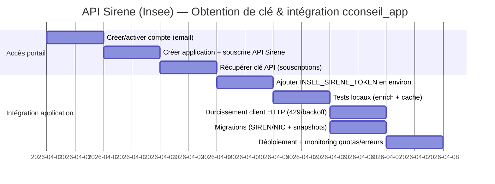

# Intégration de l’API Sirene (Insee) dans cconseil_app (Laravel) : obtention de clé, endpoints, modèle de données et plan de déploiement

## Résumé exécutif

Le dépôt **Gamo971/cconseil_app** est déjà structuré pour consommer l’API Sirene : une route interne `/api/company/enrich` appelle un service `SireneClient` pointant sur `https://api.insee.fr/api-sirene/3.11` et exige une variable d’environnement `INSEE_SIRENE_TOKEN` (via `config('services.insee.token')`). fileciteturn41file0L1-L1 fileciteturn43file0L1-L1 fileciteturn44file0L1-L1 fileciteturn38file0L1-L1

Côté portail, les sources officielles accessibles publiquement indiquent qu’avec le **nouveau portail des API**, l’accès à l’API Sirene se fait en **créant un compte**, puis **une application**, puis **une souscription** ; une **clé API d’authentification** est générée lors de la souscription, avec une **validité illimitée** mais révocable/renouvelable depuis l’onglet « souscriptions ». citeturn22search3 citeturn8search18

Sur la partie « API », les documents publics Sirene décrivent clairement : la recherche unitaire (`/siret/{siret}` ou `/siren/{siren}`) avec option `date=AAAA-MM-JJ`, la recherche multicritères (`/siret?q=…` et `/siren?q=…`, en GET ou POST, avec pagination `debut/nombre` ou pagination « curseur »), un service `informations` (utile pour supervision et synchronisation incrémentale), et des codes d’erreur normalisés (401, 429, 5xx, etc.). citeturn18search0turn18search1turn28search11turn19search0turn19search2turn27search9

Le « MVP » est donc surtout **opérationnel** : obtenir la clé, la poser dans l’environnement, et éventuellement durcir le client HTTP (gestion 429/Retry‑After, throttling, cache négatif, observabilité) et enrichir le schéma (séparer SIREN/NIC/SIRET + snapshots). La limite open data annoncée est de **30 requêtes/minute**, ce qui impose cache et/ou file d’attente pour des usages intensifs. citeturn22search0

## État des lieux dans cconseil_app et points d’intégration

Le projet est un **Laravel 11** (framework `^11.0`) sur **PHP `^8.4`**. fileciteturn31file0L1-L1

### Modèle Client et champs actuels
Le modèle `Client` possède déjà un champ `siret` (chaîne) dans `$fillable`, ainsi que `raison_sociale`, `adresse`, `forme_juridique`, `annee_creation`, etc. fileciteturn32file0L1-L1  
Le contrôleur `ClientController` valide également `siret` (max 14) et `annee_creation`. fileciteturn33file0L1-L1

### Routes internes déjà prêtes
Deux endpoints « API internes » (protégés par `auth`) existent :
- `GET /api/company/search` → `CompanySearchController`
- `GET /api/company/enrich` → `CompanyEnrichController` fileciteturn41file0L1-L1

### Stratégie actuelle : Annuaire des Entreprises + enrichissement Sirene
- `CompanySearchController` appelle un client `RechercheEntreprisesClient` (base URL `https://recherche-entreprises.api.gouv.fr`) pour proposer une recherche rapide (raison sociale / SIREN / SIRET), puis normalise une réponse simplifiée (siren, siret, label…). fileciteturn42file0L1-L1 fileciteturn45file0L1-L1  
- À la sélection, la vue `clients/create.blade.php` déclenche un enrichissement Sirene via `/api/company/enrich` (axios), et pré-remplit `forme_juridique`, `annee_creation`, `adresse`, etc. fileciteturn46file0L1-L1

### Enrichissement Sirene déjà implémenté
`CompanyEnrichController` :
- refuse l’appel si `config('services.insee.token')` est absent (erreur `missing_insee_token`),  
- nettoie le SIRET (14 chiffres),  
- met en cache 24h le résultat Sirene (`Cache::remember("sirene:siret:{$siret}", …)`),  
- mappe quelques champs (raison sociale via `denominationUniteLegale/nom…`, adresse, NAF, catégorie juridique, état administratif, indicateur siège, effectifs). fileciteturn43file0L1-L1

Le client HTTP `SireneClient` :
- utilise `Http::baseUrl('https://api.insee.fr/api-sirene/3.11')`,
- envoie un Bearer token via `withToken(config('services.insee.token'))`,
- applique `retry(2, 500)` sur 429 et 5xx,
- expose `getEtablissementBySiret($siret)` → `GET /siret/{siret}`. fileciteturn44file0L1-L1

### Variables d’environnement
Le dépôt prévoit déjà `INSEE_SIRENE_TOKEN` dans `config/services.php`. fileciteturn38file0L1-L1  
Le `.env.example` n’inclut pas encore `INSEE_SIRENE_TOKEN` (il contient en revanche des variables DB, cache, mail, etc.). fileciteturn37file0L1-L1

## Obtenir la clé d’accès API Sirene via le nouveau portail INSEE

### Ce que disent les sources publiques officielles accessibles
Les échanges publics (support) indiquent la séquence **obligatoire** :
1) créer un **compte utilisateur**,  
2) créer une **application**,  
3) **souscrire** à l’API Sirene,  
→ une **clé API d’authentification** est générée lors de la souscription, **valide sans expiration**, mais renouvelable/révocable depuis « souscriptions ». citeturn22search3

Un document d’annonce du nouveau portail indique aussi (pour « API Sirene publique ») des **droits standards** et un accès « simplifié » via une **clef d’API d’une durée illimitée** (pas de renouvellement périodique). citeturn8search18

Le catalogue a été modernisé (nouveau portail mis en service en **octobre 2024**). citeturn2search0  
De plus, plusieurs pages Sirene/Data.gouv rappellent que l’ancien portail (sans maintenance depuis le 28/02/2025) a été/sera **définitivement fermé le 10/09/2025**, et renvoient vers le nouveau portail pour la souscription. citeturn22search3turn27search7turn8search4

### Étapes UI détaillées (sources non officielles, mais cohérentes avec les libellés officiels)
Certaines pages du portail lui‑même (URL fournie) ne sont pas consultables sans session côté lecture automatisée. Pour obtenir un pas‑à‑pas UI, on trouve des guides tiers (ERP, intégrateurs) qui reprennent les libellés exacts (« CONNEXION‑POUR‑LES‑EXTERNES », « CRÉER UNE APP », « Sécurité : Simple », « Souscription », « Clés d’API »). Ils sont utiles mais doivent être vérifiés à l’écran car l’UI peut évoluer. citeturn8search0turn8search3turn8search19

Sur la base de ces guides tiers, le déroulé typique est :
- Aller sur le portail, cliquer « Se connecter », choisir **CONNEXION‑POUR‑LES‑EXTERNES**. citeturn8search0turn8search19  
- Première connexion : créer le compte, puis confirmer l’e‑mail via un message envoyé par le portail. citeturn8search3  
- Menu « Applications » → **Créer une application**. citeturn8search0turn8search3  
- Étape « Général » : remplir au minimum **Nom** + **Description** (champs obligatoires signalés), le « domaine utilisé » peut être laissé vide selon les cas décrits. citeturn8search0turn8search3  
- Étape « Sécurité » : choisir un mode **Simple** pour l’usage open data standard. citeturn8search0turn8search3  
- Étape « Souscription » : rechercher « sirene », sélectionner l’API, valider la souscription, puis récupérer la **clé d’API** dans la section « Clés d’API » de la souscription. citeturn8search0turn22search3  

**Délais d’approbation / validation** : non spécifiés pour l’API Sirene publique dans les sources publiques consultées ; le framing « ouverte à tous / droits standards » suggère une souscription généralement immédiate, mais à confirmer lors du premier essai. citeturn8search18turn22search3

### Roadmap (obtention de clé → intégration Laravel)



## Endpoints Sirene, paramètres et pagination utiles

### Base URL et en-têtes
Les documents Sirene (API 3.11) décrivent :
- services REST en HTTPS,  
- authentification via une **clé d’accès** transmise dans l’en‑tête **Authorization**,  
- format produit : `Accept: application/json`,  
- possibilité de compression `Accept-Encoding: gzip`. citeturn18search0turn18search1

Ils signalent aussi qu’à terme la présence d’un en‑tête `Content-Type` dans une requête GET pourra générer une erreur **415**. citeturn19search4turn19search5

Par ailleurs, des réponses de support mentionnent explicitement la **nouvelle URL d’appel** `https://api.insee.fr/api-sirene/3.11`. citeturn22search3  
C’est déjà la base URL utilisée par `SireneClient` dans le dépôt. fileciteturn44file0L1-L1

### Table de synthèse des endpoints à intégrer

| Besoin | Endpoint | Méthode | Paramètres clés | Pagination | Remarques |
|---|---|---:|---|---|---|
| Établissement par SIRET | `/siret/{siret}` | GET | `date=AAAA-MM-JJ` (optionnel) | N/A | Retourne `header` + `etablissement` (avec `uniteLegale` et adresses). citeturn18search0turn18search9 |
| Unité légale par SIREN | `/siren/{siren}` | GET | `date=AAAA-MM-JJ` (optionnel) | N/A | Retourne `header` + `uniteLegale` (+ périodes historisées). citeturn18search1turn18search6 |
| Recherche multicritères établissements | `/siret?q=…` | GET/POST | `q`, `date`, `debut`, `nombre`, `curseur` | `debut/nombre` ou `curseur` | POST recommandé si requête longue (limite ~2000 caractères en GET), `Content-Type: application/x-www-form-urlencoded`. citeturn28search11turn27search13 |
| Recherche multicritères unités légales | `/siren?q=…` | GET/POST | idem | idem | Même logique que `/siret`. citeturn28search11 |
| Métadonnées de service et horodatages | `/informations` | GET | aucun | N/A | Fournit `dateDerniereMiseADisposition`, `dateDernierTraitementMaximum`, etc. utile pour sync. citeturn19search4turn19search0 |
| Liens de succession (SIRET) | `/siret/liensSuccession?q=…` | GET | `q`, `curseur/nombre` | `debut/nombre` ou `curseur` | Pour suivre prédécesseur/successeur; auth via Authorization. citeturn19search5turn28search5 |

### Pagination : deux stratégies, deux usages

**Pagination “simple” (debut/nombre)** : en JSON, `nombre` est plafonné à **1000** et `debut` à **1000**; en CSV, plafonds beaucoup plus élevés (`nombre` jusqu’à **200 000**, `debut` jusqu’à **10 000**). citeturn0search11  
C’est utile en UI (petits résultats) ou pour obtenir “la plupart” des établissements d’un SIREN… mais insuffisant pour l’exhaustif à grande volumétrie.

**Pagination par curseur (recommandée pour gros volumes)** : première requête avec `curseur=*`, puis itération avec `curseur=curseurSuivant`. La fin est atteinte lorsque `curseurSuivant == curseur` et la page renvoie `nombre:0`. Il est recommandé de ne pas utiliser `tri` avec les curseurs. citeturn0search0

### Paramètre `date` : versionner la réponse
Les services unitaires `/siret/{siret}` et `/siren/{siren}` acceptent `date=AAAA-MM-JJ` pour ne renvoyer que la période couvrant cette date. citeturn18search0turn18search1turn18search4  
C’est le mécanisme principal pour obtenir “au 01/01/2015” ou “courant” (souvent en utilisant une date future). citeturn18search5turn18search4

### Exemples d’appels HTTP (curl)
> Dans l’API 3.11, la documentation publique indique l’utilisation de `Authorization` pour porter la clé d’accès. citeturn18search0turn18search1

```bash
# SIRET unitaire (période courante) — exemple URL doc
curl -H "Accept: application/json" \
     -H "Authorization: Bearer ${INSEE_SIRENE_TOKEN}" \
     "https://api.insee.fr/api-sirene/3.11/siret/32929709700035?date=2999-12-31"
```

```bash
# Recherche multicritères établissements (GET)
curl -H "Accept: application/json" \
     -H "Authorization: Bearer ${INSEE_SIRENE_TOKEN}" \
     "https://api.insee.fr/api-sirene/3.11/siret?q=siren:775672272&nombre=20"
```
La syntaxe multicritères autorise `AND`/`OR` et l’opérateur `periode(...)` pour les variables historisées. citeturn27search13turn28search4

### Exemple de réponse JSON (extrait)
Les exemples de la documentation illustrent le schéma de réponse : un bloc `header` et un bloc métier (`etablissement` ou `uniteLegale`) avec des champs clés (siren, nic, siret, diffusion, dates, etc.). citeturn18search9turn18search7

Extrait (structure) :
```json
{
  "header": { "statut": 200, "message": "ok" },
  "etablissement": {
    "siren": "329297097",
    "nic": "00035",
    "siret": "32929709700035",
    "statutDiffusionEtablissement": "O",
    "dateCreationEtablissement": "1985-01-01",
    "etablissementSiege": true,
    "uniteLegale": {
      "dateCreationUniteLegale": "1985-01-01",
      "categorieJuridiqueUniteLegale": "4110",
      "denominationUniteLegale": "…",
      "etatAdministratifUniteLegale": "C"
    }
  }
}
```
citeturn18search9turn25search6

### Codes d’erreur et gestion recommandée
La documentation des services liste des codes HTTP, notamment : **401** (jeton manquant/invalide), **429** (quota dépassé), **500/503** (erreurs serveur). citeturn19search0turn19search2  
La liste “codes retour” mentionne aussi **301** pour les unités purgées/doublons (redirection) et **403** si droits insuffisants. citeturn19search1turn19search2

Côté quotas open data, la limite indiquée est **30 requêtes par minute**. citeturn22search0

## Implémentation Laravel recommandée (token, cache, quota, erreurs, sync)

### Mettre la clé dans l’environnement (MVP immédiat)
Le dépôt attend déjà un token via `INSEE_SIRENE_TOKEN` dans `config/services.php`. fileciteturn38file0L1-L1  
**Action MVP** : ajouter dans votre `.env` (prod + local) :
```dotenv
INSEE_SIRENE_TOKEN=xxxxxxxxxxxxxxxxxxxxxxxx
```
Puis vérifier l’enrichissement dans l’écran « Nouveau client » (la vue affiche un warning spécifique si le token manque). fileciteturn46file0L1-L1 fileciteturn43file0L1-L1

### Durcir `SireneClient` : Retry‑After, throttling, cache négatif
Le client actuel retry 2 fois sur 429 et 5xx, mais **sans backoff adaptatif** ni lecture d’un éventuel `Retry-After`. fileciteturn44file0L1-L1  
Or la doc prévoit explicitement 429 en dépassement de quota. citeturn19search0turn22search0

Recommandations concrètes :
- **Backoff exponentiel** (ex : 0.5s → 1s → 2s) + **jitter**.
- Si header `Retry-After` présent, **dormir** ce temps avant retry (ou replanifier via queue).
- **Limiter côté app** (RateLimiter Laravel) à ~25/min pour garder une marge sous 30/min.
- **Cache négatif** court sur 404 (ex : 10 minutes) pour ne pas marteler des identifiants invalides.
- **Timeout** raisonnable (déjà 10s) + métriques (latence, taux d’échec) : utile car 500/503 existent. citeturn19search0turn19search2

### Exemple de service Laravel (client Sirene « complet »)
Exemple (à adapter) : un service qui gère `siret`, `siren`, recherche multicritères, et le endpoint `informations`.

```php
<?php

namespace App\Services\CompanyData;

use Illuminate\Http\Client\PendingRequest;
use Illuminate\Http\Client\RequestException;
use Illuminate\Support\Facades\Cache;
use Illuminate\Support\Facades\Http;

final class SireneApi
{
    private const BASE_URL = 'https://api.insee.fr/api-sirene/3.11';

    private function http(): PendingRequest
    {
        $token = (string) config('services.insee.token');

        // IMPORTANT: la doc publique mentionne Authorization pour porter la clé d’accès.
        // On conserve Bearer car c’est déjà le pattern du projet ; ajuster si l’Insee impose un autre header.
        return Http::baseUrl(self::BASE_URL)
            ->acceptJson()
            ->withToken($token)
            ->timeout(10);
    }

    /**
     * GET /siret/{siret}?date=YYYY-MM-DD
     */
    public function etablissement(string $siret, ?string $date = null): array
    {
        $siret = substr(preg_replace('/\D+/', '', $siret), 0, 14);
        if (strlen($siret) !== 14) {
            throw new \InvalidArgumentException("SIRET invalide");
        }

        $cacheKey = "sirene:siret:{$siret}:date:" . ($date ?: 'current');

        return Cache::remember($cacheKey, now()->addHours(24), function () use ($siret, $date) {
            $resp = $this->http()->retry(
                4,
                fn ($attempt) => min(2000, 250 * (2 ** ($attempt - 1))), // 250, 500, 1000, 2000 ms
                function ($exception) {
                    $r = $exception->response;
                    return $r && in_array($r->status(), [429, 500, 502, 503, 504], true);
                }
            )->get("/siret/{$siret}", array_filter(['date' => $date]));

            $resp->throw();
            return $resp->json();
        });
    }

    /**
     * GET /siren/{siren}?date=YYYY-MM-DD
     */
    public function uniteLegale(string $siren, ?string $date = null): array
    {
        $siren = substr(preg_replace('/\D+/', '', $siren), 0, 9);
        if (strlen($siren) !== 9) {
            throw new \InvalidArgumentException("SIREN invalide");
        }

        $resp = $this->http()->get("/siren/{$siren}", array_filter(['date' => $date]));
        $resp->throw();

        return $resp->json();
    }

    /**
     * GET /informations
     */
    public function informations(): array
    {
        $resp = $this->http()->get('/informations');
        $resp->throw();

        return $resp->json();
    }

    /**
     * Recherche multicritères (GET). Pour requêtes longues, prévoir une variante POST.
     */
    public function searchEtablissements(string $q, int $nombre = 20, int $debut = 0, ?string $curseur = null): array
    {
        $params = [
            'q' => $q,
            'nombre' => $nombre,
        ];

        if ($curseur !== null) {
            $params['curseur'] = $curseur;
        } else {
            $params['debut'] = $debut;
        }

        $resp = $this->http()->get('/siret', $params);
        $resp->throw();

        return $resp->json();
    }
}
```

Les endpoints et paramètres cités (unitaires, `date`, multicritères `q/debut/nombre/curseur`, `informations`) correspondent à la documentation publique de l’API 3.11. citeturn18search0turn18search1turn28search11turn19search4turn0search0

### Stratégie de synchronisation incrémentale (si vous voulez “tenir un référentiel”)
Si, à terme, l’application doit maintenir un miroir partiel (ex : vos clients + prospects) et les tenir à jour automatiquement :
- utiliser `dateDernierTraitementUniteLegale` et `dateDernierTraitementEtablissement` comme pivot d’incrémental,  
- s’appuyer sur le service `informations` pour vérifier `dateDernierTraitementMaximum` et `dateDerniereMiseADisposition`,  
- tenir compte du fait que les données basculent quotidiennement (effet J‑2 → J‑1) et peuvent rendre une pagination incohérente autour de `dateDerniereMiseADisposition`. citeturn27search9turn19search4

La volumétrie quotidienne annoncée est de l’ordre de **20 000** unités/jour par collection, avec un surplus hebdomadaire (lundi) sur la collection établissements depuis avril 2025. citeturn27search9  
Dans ce scénario, une ingestion “bulk” doit impérativement passer par curseurs + queue + throttling pour rester sous le quota et éviter les incohérences. citeturn0search0turn22search0turn19search4

## Modèle de données, tests et mise en production

### Mapping conseillé vers vos entités (Client)
Rappels variables clés utiles :
- `siret` = 14 chiffres ; les 9 premiers = `siren`, les 5 derniers = `nic`. citeturn25search4turn18search9  
- Exemples de variables de réponse : `dateCreationEtablissement`, `trancheEffectifsEtablissement`, `anneeEffectifsEtablissement`, `codeCommuneEtablissement`, variables de géolocalisation (Lambert) — masquées `[ND]` en diffusion partielle. citeturn18search2turn25search1turn22search4  
- Variables unité légale (ex : `categorieJuridiqueUniteLegale`, `activitePrincipaleUniteLegale`, `nomenclatureActivitePrincipaleUniteLegale`). citeturn18search9turn25search2turn25search4  

Proposition (évolution `clients`) :

| Champ DB | Source Sirene | Commentaire |
|---|---|---|
| `siret` (déjà présent) | `etablissement.siret` | Identifiant établissement. fileciteturn32file0L1-L1 citeturn18search9 |
| `siren` (à ajouter) | `etablissement.siren` | Dérivable de `siret`, mais utile en index/filtre. citeturn18search9turn25search4 |
| `nic` (à ajouter) | `etablissement.nic` | Le “suffixe” établissement. citeturn18search9turn25search4 |
| `raison_sociale` (déjà présent) | `uniteLegale.denominationUniteLegale` (ou champs “nom…”) | Dépend personne morale/physique, attention diffusion partielle. citeturn18search9turn22search4 |
| `naf` (à ajouter ou via `secteur`) | `activitePrincipaleUniteLegale` / `activitePrincipaleEtablissement` | Stocker aussi la nomenclature si besoin. citeturn25search4turn25search2 |
| `categorie_juridique` (à ajouter) | `categorieJuridiqueUniteLegale` | Mieux que “CJ 5710” en texte libre. citeturn18search9turn25search2 |
| `etat_administratif` (à ajouter) | `etatAdministratifUniteLegale` / `etatAdministratifEtablissement` | A/C pour UL, A/F pour établissement selon périodes. citeturn18search9turn25search1 |
| `sirene_last_synced_at` (à ajouter) | N/A | Date d’enrichissement dans votre app. |
| `sirene_payload_hash` (à ajouter) | N/A | Détection de changement sans conserver tout. |

### Snapshots : table dédiée (audit et traçabilité)
Pour garder une trace des enrichissements (utile en cas de contestation, de mise à jour, ou de changement de statut de diffusion), créer une table `sirene_snapshots` :
- `id`, `client_id`, `siret`, `siren`, `source` (= "sirene"), `fetched_at`, `payload` (JSON), `payload_hash`, `http_status`, `error_code`, `quota_bucket`, etc.
- Politique de rétention (ex : 90 jours) si vous conservez `payload` complet, car certaines données sont personnelles. Les CGU rappellent explicitement la présence de données personnelles et la nécessité de tenir compte du statut de diffusion. citeturn27search0turn22search0

### Tests (sans sandbox officielle explicite)
Les documents consultés ne décrivent pas un “sandbox” dédié accessible publiquement ; historiquement, une version “statique de test” est mentionnée pour la transition 3.9 → 3.11, mais l’approche la plus robuste côté Laravel reste le mock. citeturn26search0

Recommandation :
- tests unitaires : `Http::fake()` pour stubs 200/401/429/500,
- tests d’intégration “contrat” en staging : appels réels très limités (throttling) pour vérifier auth + schéma JSON,
- fixtures basées sur des exemples publics de la documentation (structures `header/etablissement/uniteLegale`). citeturn18search9turn19search0

### Checklist conformité (open data + données personnelles)
1) **Licence de réutilisation** : licence « Licence Ouverte / Open Licence » (Etalab) pour la réutilisation des données Sirene. citeturn27search0  
2) **Données personnelles / usage** : interdiction de réutiliser/rediffuser certaines informations de personnes en diffusion partielle à certaines fins (notamment prospection), et obligation de tenir compte du statut de diffusion le plus récent. citeturn22search0turn27search0turn22search4  
3) **Diffusion partielle** : présence de valeurs `[ND]` sur certains champs (identification/localisation) pour les entités en statut “P”. citeturn22search4turn25search1  
4) **Quota** : limiter à 30/min (open data) + intégrer backoff/queue/cache. citeturn22search0turn19search0  
5) **Journalisation** : ne pas logger la clé API; logger uniquement des identifiants techniques (siret, statut HTTP, latence, x-request-id si disponible).  
6) **Révocation/rotation** : la clé peut être renouvelée/révoquée depuis “souscriptions” ; prévoir procédure interne de rotation et redéploiement. citeturn22search3  

### Priorités pour une intégration minimale viable dans votre app
- **Quick win (moins d’une heure)** : obtenir la clé, ajouter `INSEE_SIRENE_TOKEN` en `.env`, valider que l’enrichissement Sirene s’affiche sur la création client. fileciteturn43file0L1-L1 fileciteturn46file0L1-L1  
- **Durcissement (1–2 jours)** : améliorer le client HTTP (429/Retry‑After, throttling, cache négatif), ajouter une route de “healthcheck Sirene” basée sur `/informations`, et métriques/alerting. citeturn19search4turn19search0turn22search0  
- **Évolution modèle (1–2 jours)** : ajouter `siren/nic`, table snapshots, et une tâche planifiée d’actualisation ciblée (uniquement sur vos clients actifs), en respectant la synchro incrémentale `dateDernierTraitement…`. citeturn27search9turn19search4