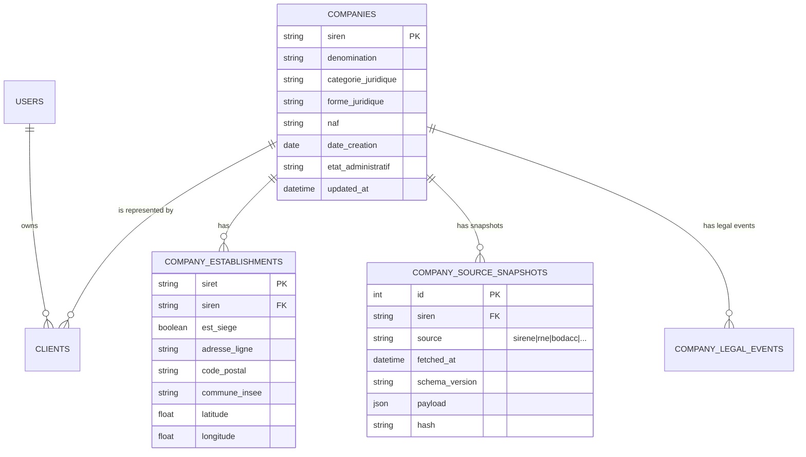
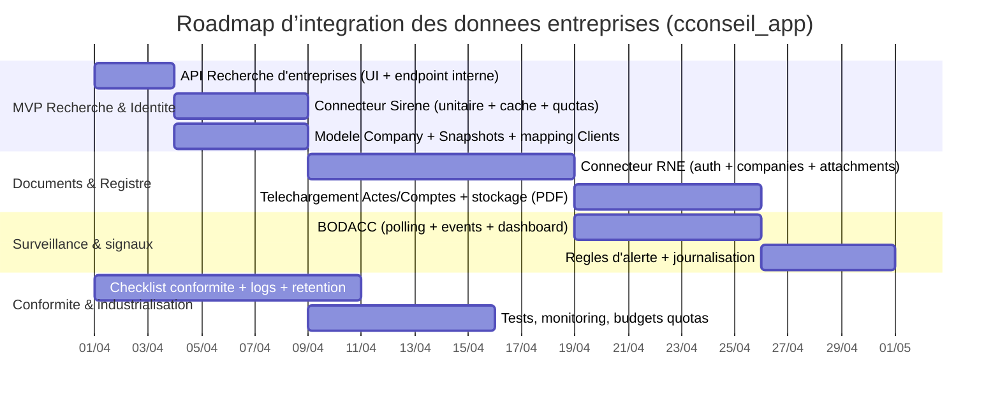

# Sources publiques françaises de données d’entreprises et intégration dans cconseil_app

## Résumé exécutif

Votre dépôt **cconseil_app** met en place une application **Laravel 11** (PHP **8.4** côté `composer.json`) conteneurisée (Nginx + PHP-FPM + MySQL + phpMyAdmin), avec une ressource “clients” qui stocke déjà un **SIRET** saisi manuellement et des champs métier (raison sociale, adresse, forme juridique, année de création, secteur…). fileciteturn18file0L1-L1 fileciteturn7file0L1-L1 fileciteturn8file0L1-L1 fileciteturn19file0L1-L1 fileciteturn22file0L1-L1

Pour une **intégration minimale viable** (MVP) des données publiques françaises d’entreprises dans cette appli, la combinaison la plus efficace est :

- **Recherche & autocomplétion** : API *Recherche d’entreprises* (Annuaire des Entreprises) — ouverte, sans authentification, **limite 7 req/s**, idéale pour trouver rapidement le bon établissement depuis le formulaire “Créer un client”. citeturn27view0  
- **Détails officiels d’identité** : **API Sirene open data** (Insee) — données de référence (SIREN/SIRET, adresse normalisée, NAF/APE, statut actif/fermé, historique), avec **quota open data 30 req/min** (à gérer par cache et file de jobs). citeturn38view0turn39search1turn43search5turn35search3  
- **Documents & événements légaux** (phase 2) : **INPI / RNE** (Registre national des entreprises) — APIs pour *entreprises (CMC)*, *actes (PDF)*, *comptes annuels (PDF + données saisies)*, mises à jour **quotidiennes**, mais avec **authentification (login/mot de passe)** et contraintes fortes sur données personnelles et prospection. citeturn4search2turn5view0turn9view0turn11view0turn13view0  
- **Surveillance “risque”** (phase 3) : **BODACC** (annonces légales) via l’API/dataset de la DILA — utile pour détecter procédures collectives, radiations, dépôts de comptes, etc. (publication 5 fois/semaine ; licence ouverte, mais attention données personnelles). citeturn14view1turn4search1turn15view3  

Sur le plan architecture, l’approche robuste consiste à :
- **Conserver l’identifiant maître = SIREN** (entreprise) et **SIRET** (établissement), en ajoutant un **modèle “CompanyProfile”** (ou extension de `clients`) + une table **CompanySourceSnapshot** (JSON brut horodaté et sourcé) ; et
- Mettre en place un **pipeline d’ingestion** en arrière-plan (jobs + scheduler Laravel) : *lookup à la création*, puis *synchronisation incrémentale* (polling quotidien/hebdo) selon quotas et besoins. fileciteturn22file0L1-L1 citeturn9view0turn43search0turn30view0  

Enfin, la conformité doit être structurée dès le MVP : **attribution + date de mise à jour**, respect des statuts de diffusion / oppositions, limitation de rediffusion et maîtrise de la prospection, et prise en compte du cadre **CRPA** et des recommandations **CNIL**. citeturn18search2turn42search6turn42search0turn42search1turn3search5turn9view0turn15view3  

## Analyse du dépôt cconseil_app et points d’intégration

Le dépôt fournit une base opérationnelle “Consulting OS” avec :
- Un environnement Docker (services applicatifs + DB). fileciteturn7file0L1-L1  
- Une app **Laravel 11** (squelette présent dans `src/`), avec dépendances PHP indiquant `php: ^8.4`. fileciteturn18file0L1-L1  
- Une ressource **Client** :
  - `Client` stocke déjà `siret`, `raison_sociale`, `adresse`, `forme_juridique`, `annee_creation`, etc. fileciteturn19file0L1-L1  
  - `ClientController@store` valide et enregistre un `siret` (max 14) sans enrichissement automatique. fileciteturn22file0L1-L1  
- Un tableau de bord qui agrège des indicateurs par client/mission (donc un bon point d’accroche pour afficher des alertes “juridiques” ou “administratives” issues des registres). fileciteturn28file0L1-L1  

**Intégration naturelle dans l’existant** (sans refonte UI) :
1. Dans le formulaire `clients.create`, vous ajoutez une **recherche** (raison sociale / adresse / SIRET) qui appelle un endpoint interne `GET /api/company/search`.
2. À la sélection d’un résultat, vous pré-remplissez `raison_sociale`, `adresse`, `forme_juridique`, `annee_creation`, `secteur`, `siret`.
3. À la validation, un job `EnrichClientFromRegistries` :
   - vérifie le SIRET,
   - appelle *API Sirene* (données d’identité complètes),
   - (optionnel) appelle *RNE* pour RCS/actes/comptes non confidentiels,
   - écrit un snapshot “source” + met à jour les champs “métier” du client. fileciteturn22file0L1-L1 citeturn38view0turn9view0turn11view0  

## Cartographie des sources et comparaison

### Panorama des sources publiques (et quasi-publiques) les plus utiles

Les sources ci-dessous sont celles que l’on retrouve le plus souvent dans les chaînes KYC/tiers/CRM en France. Elles couvrent : **identité**, **immatriculation**, **événements légaux**, **documents** (actes, comptes), **marchés publics**, **information réglementée** et **bénéficiaires effectifs** (accès restreint).

> **Note “URL”** : les références officielles sont fournies via les citations cliquables, et les URL copiables sont regroupées plus bas (section “Références URL copiables”).  

#### Tableau comparatif (synthèse)

| Source | Mainteneur | Couverture principale | Fraîcheur typique | Accès | Coût | Licence / contraintes clés |
|---|---|---|---|---|---|---|
| API Recherche d’entreprises (Annuaire) | entity["organization","Direction interministérielle du numérique","french digital directorate"] | Recherche textuelle + géographique sur entreprises/assos/services publics (résultats limités vs Sirene complet) citeturn27view0turn29view0 | Dépend du socle (Sirene + enrichissements) ; API ouverte avec quota | API HTTP JSON (OpenAPI) citeturn29view0turn30view0 | Gratuit | Quota **7 req/s**, `429` + `Retry-After` ; recommandé `User-Agent` explicite citeturn27view0turn29view0 |
| API Sirene open data | entity["organization","Institut national de la statistique et des études économiques","french statistics office"] | Référentiel SIREN/SIRET (unités légales + établissements), historique, statut actif/fermé, NAF/APE, etc. citeturn3search0turn39search1turn43search1 | Mise à jour **quotidienne** (intègre les mises à jour de la veille) citeturn3search0turn43search1 | API HTTP JSON + CSV, clé/jeton via portail ; multicritères, pagination/cursor citeturn38view0turn39search1turn43search0turn43search5 | Gratuit | Quota open data **30 req/min** ; respect diffusion partielle/opposition prospection citeturn38view0turn3search5 |
| Base Sirene “fichiers stock” | Insee | Dumps complets (unités légales, établissements, historisés, liens de succession) citeturn3search0turn3search1 | Stock souvent **mensuel** (diffusion “fichiers”) citeturn3search1 | Bulk (data.gouv) citeturn3search0turn3search1 | Gratuit | Licence ouverte + obligations données personnelles citeturn3search5turn18search2 |
| RNE (Registre national des entreprises) – API Entreprises | entity["organization","Institut national de la propriété industrielle","french ip office"] | Registre unique depuis 01/01/2023 (fusion RNCS/RM/RAA), données entreprises + C/M/C, actes, comptes annuels (non confidentiels) citeturn4search2turn5view0 | Mises à jour **quotidiennes** (CMC, actes, comptes) citeturn5view0turn6view0 | API + SFTP ; JSON + PDF citeturn5view0turn6view0turn11view0turn13view0 | Gratuit (open) / + accès habilités pour confidentiel | Interdiction/limites prospection et gestion non-diffusibles ; variables `diffusionCommerciale`/`diffusionINSEE` citeturn9view0 |
| BODACC (annonces civiles & commerciales) | entity["organization","Direction de l'information légale et administrative","french legal info office"] | Ventes/cessions, immatriculations, modifications/radiations, procédures collectives, dépôts de comptes (A/B/C) citeturn14view1turn4search1 | Publication **5 fois par semaine** citeturn14view1 | Dataset + API (plateforme Opendatasoft) citeturn4search1turn14view1 | Gratuit | Licence ouverte ; avertissement données personnelles / non réidentification citeturn14view1turn15view3 |
| BALO (annonces légales obligatoires) | DILA | Sociétés faisant appel public à l’épargne : opérations financières, convocations AG, comptes annuels citeturn40search1turn40search2 | Mise à dispo **lundi/mercredi/vendredi** citeturn40search2 | Flux XML + annonces PDF/HTML + API citeturn40search2turn40search1 | Gratuit | Licence ouverte + avertissement données personnelles citeturn40search1turn40search2 |
| BOAMP (marchés publics) | DILA | Avis d’appel public à la concurrence + résultats, etc. ; diffusion 2 fois/jour citeturn40search0turn40search4turn40search7 | **2 fois par jour, 7j/7** (publication) citeturn40search4turn40search7 | API + données associées (schémas, historique) citeturn40search4turn40search0 | Gratuit | Licence ouverte ; avertissement données personnelles citeturn40search0 |
| info-financière (OAM / AMF) | DILA + entity["organization","Autorité des marchés financiers","french financial regulator"] | Documents réglementés des sociétés cotées (directive transparence) citeturn40search9 | Dépend des dépôts émetteurs | API ouverte | Gratuit | Cadre réglementaire OAM ; utile pour sociétés cotées citeturn40search9 |
| DataInfogreffe / opendata.datainfogreffe | entity["company","Infogreffe","rcs registry service france"] | Données issues du RCS (selon offres : open data / API / access) ; mises à jour quotidiennes annoncées citeturn21view0 | Quotidienne annoncée citeturn21view0 | Explore API v2 + jeux de données (certains nécessitent connexion) citeturn25view0turn24search1 | Gratuit (open data) / Payant (API crédits / access) citeturn21view0 | Licence variable selon datasets ; attention conditions portail externe citeturn24search1turn25view0 |
| RBE (bénéficiaires effectifs) | INPI / DINUM (selon API) | Déclarations bénéficiaires effectifs, PDF + données XML ; **accès restreint** citeturn41search4turn41search0 | Dépend des dépôts | API restreinte (habilitation / intérêt légitime) citeturn41search4turn41search0 | Variable | Accès public restreint depuis 31/07/2024 (conditions) citeturn41search0turn41search2 |

### Référentiels connexes recommandés (qualité d’adresse)

Même si ce ne sont pas des “données d’entreprise” au sens strict, la normalisation d’adresse est un accélérateur fort de qualité pour Sirene/RNE (matching, dédoublonnage, géolocalisation). Le référentiel public majeur est la **BAN**, pilotée par la DINUM et diffusée par l’IGN, sous licence ouverte. citeturn44search5turn44search7  
Attention : l’ancienne “API Adresse BAN” est indiquée comme **dépréciée** et intégrée dans le service de géocodage de la Géoplateforme, avec décommissionnement annoncé fin janvier 2026. citeturn44search0  

## Accès techniques et intégration par source

### API Recherche d’entreprises (MVP idéal pour l’autocomplétion)

**Pourquoi c’est utile dans votre app** : vous avez un écran de création client qui demande `raison_sociale`, `adresse`, `siret` (optionnel), etc. L’API peut fournir une **liste de candidats** à sélectionner, et vous confirmez ensuite via Sirene. fileciteturn22file0L1-L1 citeturn27view0turn30view0  

**Accès**  
- Base URL : `https://recherche-entreprises.api.gouv.fr` (OpenAPI) citeturn29view0  
- Endpoints majeurs :
  - `GET /search` (recherche textuelle) avec `q`, `page`, `per_page` (limité à 25), filtres NAF / code postal / statut, etc. citeturn30view0turn29view0  
  - `GET /near_point` (recherche géographique) citeturn30view0turn29view0  
- Quotas : **7 appels / seconde** (et gestion 429 + `Retry-After`). citeturn27view0turn29view0  

**Exemple HTTP (cURL) – recherche simple**  
```bash
curl -sS \
  -H "Accept: application/json" \
  -H "User-Agent: cconseil_app/1.0 (contact: support@votre-domaine)" \
  "https://recherche-entreprises.api.gouv.fr/search?q=boulangerie%20marseille&page=1&per_page=10"
```
Pagination `page/per_page` (per_page ≤ 25) citeturn30view0.

**Stratégie d’intégration (recommandée)**  
1) Autocomplétion (UI) : `q` + éventuellement `code_postal`/`departement` pour réduire le bruit. citeturn29view0turn30view0  
2) Au clic utilisateur, récupérer **SIRET + SIREN + NAF**, puis appeler **API Sirene** pour la fiche exhaustive (et éviter les limites fonctionnelles de la recherche ouverte). citeturn27view0turn38view0  

### API Sirene open data (socle d’identité officiel)

**Positionnement** : référentiel “état civil” des entreprises/établissements, gratuit, multi-critères et historisé. L’Insee rappelle que les données Sirene sont accessibles via l’Annuaire, l’API et des fichiers stock. citeturn3search0turn3search1  

**Accès & quotas (open data)**  
- Quota indicatif : **30 requêtes / minute** (usages open data). citeturn38view0  
- Format : JSON (et CSV pour certaines extractions). citeturn43search5turn39search1  
- Authentification : clé/jeton dans `Authorization` (délivré par le portail des API). citeturn35search3turn39search1  
- Contraintes juridiques : licence ouverte + obligations sur données personnelles, statut de diffusion, et interdiction d’usage prospection selon cas. citeturn3search5turn38view0turn18search2  

**Endpoints indispensables**  
- Unitaire établissement : `GET https://api.insee.fr/api-sirene/3.11/siret/{siret}` (+ `?date=YYYY-MM-DD`) citeturn35search3  
- Unitaire unité légale : `GET https://api.insee.fr/api-sirene/3.11/siren/{siren}` citeturn35search2  
- Multi-critères (recherche libre) :  
  - `GET https://api.insee.fr/api-sirene/3.11/siret?q=...`  
  - `GET https://api.insee.fr/api-sirene/3.11/siren?q=...` citeturn39search1turn39search2  
- Recherche “simplifiée” sur raison sociale : `.../siren?q=raisonSociale:{recherche}` (et équivalent SIRET) citeturn39search0  

**Pagination**  
- `debut` / `nombre` : en JSON, `nombre` ≤ 1000 et `debut` ≤ 1000 (au-delà, utiliser curseur). citeturn43search5turn43search0  
- `curseur=*` puis `curseurSuivant` : recommandé pour grands volumes ; ne pas utiliser `tri` avec curseur. citeturn43search0  

**Exemple HTTP (cURL) – établissement par SIRET**  
```bash
curl -sS \
  -H "Accept: application/json" \
  -H "Authorization: Bearer $INSEE_SIRENE_TOKEN" \
  "https://api.insee.fr/api-sirene/3.11/siret/12345678900012"
```
(Endpoint et usage du header `Authorization` documentés) citeturn35search3  

**Exemple HTTP – recherche par raison sociale (simplifiée)**  
```bash
curl -sS \
  -H "Accept: application/json" \
  -H "Authorization: Bearer $INSEE_SIRENE_TOKEN" \
  "https://api.insee.fr/api-sirene/3.11/siren?q=raisonSociale:DUPONT&nombre=10"
```
Syntaxe “raisonSociale” citeturn39search0turn43search5  

**Gestion d’erreurs (à prévoir en dur)**  
- `401` si jeton manquant/invalide ; `429` si dépassement quota. citeturn32search3turn38view0  
Dans Laravel, cela se gère proprement via retry/backoff et cache (section “modèle & synchro”).

### RNE (INPI) : entreprises, actes, comptes annuels

**Positionnement** : depuis le 1er janvier 2023, le RNE est le registre unique (fusion RNCS/RM/RAA) et l’INPI en est l’opérateur ; une partie des données est diffusée gratuitement sur Data INPI, format JSON, avec API. citeturn4search2turn5view0  

#### API “formalités / entreprises (CMC)” : recherche & diff

Le document technique (v4.0) décrit :
- Auth : `POST /api/sso/login` (username/password) → token bearer. citeturn9view0  
- Recherche : `GET /api/companies` (filtres `page`, `pageSize` 1..100, `siren[]`, `companyName`, dates, secteurs, etc.). citeturn9view0  
- Détail : `GET /api/companies/{siren}` citeturn9view0  
- Diff (incrémental) : `GET /api/companies/diff?` avec `from/to`, `pageSize`, `searchAfter` (cursor-like). citeturn9view0  

**Contraintes fortes**  
Le document rappelle explicitement :
- respect de l’opposition à la réutilisation à des fins de prospection (référence au Code de commerce) et la présence d’une variable `diffusionCommerciale` ; citeturn9view0  
- traitement des entreprises “non diffusibles” (variable `diffusionINSEE`), non rediffusables par un rediffuseur même si elles sont publiées par le registre. citeturn9view0  

#### Comptes annuels (PDF + données saisies JSON)

Le document technique (v5) expose :
- Connexion identique (`/api/sso/login`). citeturn11view0  
- Liste des pièces d’une entreprise : `GET /api/companies/{siren}/attachments` renvoyant `bilans`, `bilansSaisis`, etc. (avec `confidentiality`, `deleted`, `id`…). citeturn11view0  
- Données saisies : `GET /api/bilans-saisis/{id}`. citeturn11view0  
- Gestion des suppressions : `deleted=true` implique suppression côté rediffuseur si déjà téléchargé. citeturn11view0  

C’est particulièrement pertinent pour votre table `financial_data`, qui prévoit déjà une source `import_api` : vous pouvez importer certains agrégats (CA, résultat…) depuis les bilans saisis, si compatibles avec vos KPI. fileciteturn27file0L1-L1 citeturn11view0  

#### Actes (PDF)

Le document actes (v4.0) expose :
- Identifiants d’actes par entreprise : `GET /api/companies/{siren}/attachments` citeturn13view1  
- Métadonnées d’un acte : `GET /api/actes/{id}` citeturn13view0  
- Téléchargement PDF : `GET /api/actes/{id}/download` citeturn13view0  
- Recherche différentielle : `GET /api/actes?dateFrom=...` etc ; pagination via `searchAfter` (en-tête). citeturn13view0  

**Intégration recommandée** : pour un cabinet, l’intérêt est surtout “dossier client” :
- un onglet “Documents publics” (actes / comptes non confidentiels) ;
- un job hebdomadaire qui récupère les nouveaux `attachments` pour vos clients “actifs”.

### BODACC : annonces légales et surveillance

Le jeu de données BODACC décrit :
- Périmètre : immatriculations/créations/modifications/radiations, procédures collectives, dépôts de comptes, etc. citeturn14view1  
- Rythme : bulletins 5 fois par semaine, répartis en BODACC A/B/C. citeturn14view1  
- API : annoncée comme accessible gratuitement (licence ouverte + CGU) et conçue pour filtrer/télécharger en CSV/JSON/Excel. citeturn4search1turn14view0  
- Données personnelles : avertissement DILA : la réutilisation d’informations publiques contenant des données personnelles est encadrée, notamment interdiction de réidentifier. citeturn15view3  

**Intégration dans votre dashboard** : associer des alertes “juridiques” au portefeuille (ex. procédures collectives, radiations, cessions). Le tableau de bord existant calcule déjà “clients en alerte” et “actions urgentes”, ce qui se prête bien à une section “alertes légales”. fileciteturn28file0L1-L1 citeturn14view1turn4search1  

### BOAMP, BALO, info-financière : signaux externes (optionnels, mais utiles)

- **BOAMP** : API gratuite ; données publiées **2 fois par jour, 7j/7** ; utile si vous voulez enrichir un client par son activité marchés publics ou surveiller des avis. citeturn40search0turn40search4turn40search7  
- **BALO** : données mises à dispo lundi/mercredi/vendredi, annonces en XML + PDF/HTML ; pertinent pour clients cotés/émetteurs. citeturn40search2turn40search1  
- **info-financière** : accès aux documents réglementés des sociétés cotées transmis via l’AMF (directive transparence, OAM). citeturn40search9  

### DataInfogreffe / RCS : alternative “greffes” (selon besoins)

Infogreffe présente DataInfogreffe comme un portail open data, avec accès via jeux de données et APIs, mises à jour quotidiennes annoncées ; mais avec une segmentation d’offres (open data vs API crédits vs access illimité). citeturn21view0turn20search0  
Sur data.gouv, un service “Explore API v2” est référencé pour `opendata.datainfogreffe.fr`. citeturn25view0turn24search4  

**Conseil** : à réserver si vous avez un cas d’usage “RCS **certifié greffe**” spécifique (ou si vous voulez des datasets stats), car le RNE (INPI) + Sirene + BODACC couvrent déjà le cœur d’un CRM cabinet.

### RBE : bénéficiaires effectifs (accès restreint, à cadrer)

Depuis le 31 juillet 2024, l’accès aux données des bénéficiaires effectifs est indiqué comme **restreint** (autorités, assujettis LCB-FT, ou intérêt légitime), suite au contexte CJUE et aux textes cités, et l’INPI décrit une procédure de demande d’accès. citeturn41search0turn41search2  
Sur data.gouv, l’API RBE est indiquée “Restreint / demande d’habilitation”, et fournit PDF + données XML. citeturn41search4turn41search6  

**MVP** : ne pas l’intégrer tant que vous n’avez pas clarifié votre éligibilité et vos bases légales.

## Modèle de données et stratégies de synchronisation

### Identifiants et mapping conseillés

Dans votre modèle actuel, `Client` stocke `siret` comme simple chaîne. fileciteturn19file0L1-L1  
Pour fiabiliser les jointures inter-sources :

- **SIREN (9 chiffres)** : identifiant maître “entreprise/unité légale”.
- **SIRET (14 chiffres)** : établissement ; se décompose en SIREN + NIC.
- **NAF/APE** : code activité.
- **RCS / greffe / numéro de gestion** : plutôt côté RNE (INPI) et sources greffes (actes/comptes). citeturn11view0turn9view0  

### Schéma cible (simple et compatible Laravel)

Option A (minimale) : étendre `clients` avec champs normalisés + conserver JSON brut.

Option B (plus propre) : introduire `companies` et faire pointer `clients` vers `companies`.

Ci-dessous un schéma “B” (recommandé si vous prévoyez multi-clients/tiers par entreprise) :



### Stratégies de synchronisation (par source)

**API Recherche d’entreprises**  
- Pas de “sync” : c’est une API de recherche. Cacher les réponses (ex. 24h) pour limiter les appels. Quota 7 req/s à respecter. citeturn29view0turn27view0  

**API Sirene**  
- “Just-in-time” au moment de la création/édition client + refresh périodique léger (ex. mensuel), car quota 30/min. citeturn38view0  
- En cas de besoin “portefeuille”, privilégier **batch différé** via fichiers stock (si vous devez traiter des volumes). citeturn3search0turn3search1  
- Pagination : utiliser curseur si extraction > 1000 résultats. citeturn43search0turn43search5  

**RNE (INPI)**  
- Pour vos clients suivis : polling quotidien/hebdomadaire sur `attachments` (actes/comptes) + usage de `diff`/recherche différentielle si vous industrialisez. citeturn9view0turn11view0turn13view0  
- Respecter les drapeaux de diffusion / confidentialité / suppression (`deleted`). citeturn9view0turn11view0  

**BODACC**  
- Polling quotidien/bi-hebdo par SIREN (ou par période + filtre), puis inscription d’événements dans `company_legal_events`. Publication 5 fois/semaine. citeturn14view1turn4search1  

### Tolérance aux quotas et robustesse applicative

La robustesse “production” nécessite :
- cache applicatif (Redis conseillé) + cache HTTP (`ETag` si exposé) ;
- retry/backoff sur `429` (avec respect `Retry-After` lorsque présent) — explicitement mentionné par l’API Recherche d’entreprises. citeturn29view0turn27view0  
- circuit breaker (désactiver temporairement un connecteur en cas d’erreurs répétées).

## Défis techniques et conformité

### Défis techniques majeurs et solutions

**Qualité / cohérence inter-sources**  
- Sirene est le référentiel d’identité, mais certaines informations “légales” (actes, comptes) sont plutôt côté RNE ; BODACC fournit des événements. Le croisement implique un modèle “source-of-truth” par champ (ex. adresse = Sirene ; documents = RNE ; événements = BODACC). citeturn3search0turn5view0turn14view1  

**Dédoublonnage & matching**  
- Le matching déterministe se fait via SIRET/SIREN (fiable). API Recherche peut retourner plusieurs candidats : imposez une validation UI + confirmation Sirene unitaire. citeturn27view0turn35search3  
- Pour les cas sans SIRET (prospects) : matching probabiliste (raison sociale + commune + code postal + NAF) puis confirmation par SIRET dès que possible (contrat / facture). citeturn30view0turn39search0  

**Historique**  
- Sirene expose des variables historisées et des requêtes à date (`?date=`) ; utile pour “à la date de la mission” (diagnostic). citeturn35search3turn39search1turn3search0  
- RNE actes depuis 1993 (stock) et comptes depuis 2017 (non confidentiels) selon la documentation INPI. citeturn5view0turn11view0  

**Adresses et géocodage**  
- L’API Adresse BAN historique est annoncée dépréciée et intégrée à la Géoplateforme (décommissionnement fin janvier 2026). citeturn44search0  
- Recommandation : standardiser via le nouveau service de géocodage, et stocker `geo_id`/coords si nécessaires (l’API Recherche expose déjà des coordonnées issues d’une BAN/Sirene géocodée selon cas). citeturn30view1turn44search0turn44search5  

### Checklist conformité (prête à intégrer à vos procédures)

Cadre général de réutilisation :
- Mentionner **source** et **date de dernière mise à jour** lors de la réutilisation (obligation CRPA L322-1) et respecter la licence (Licence Ouverte 2.0 : attribution). citeturn42search6turn18search2turn18search0  
- Si données personnelles : la réutilisation est subordonnée au respect de la loi Informatique & Libertés (CRPA L322-2). citeturn42search0turn15view3turn3search5  
- Appliquer les recommandations CNIL/CADA sur ouverture/réutilisation. citeturn42search1  

Spécifique Sirene :
- Respecter le **statut de diffusion** et les obligations rappelées dans les CGU (données personnelles, responsabilité du réutilisateur). citeturn3search5turn38view0  

Spécifique RNE (INPI) :
- Respecter l’opposition à la prospection, prendre en compte `diffusionCommerciale` et traiter `diffusionINSEE` (non diffusibles non rediffusables). citeturn9view0  
- Respecter la confidentialité des comptes/actes et supprimer les documents si `deleted=true`. citeturn11view0turn13view0  

Spécifique BODACC / DILA :
- Ne pas tenter de réidentifier des personnes à partir de données anonymisées/partiellement anonymisées ; respecter l’avertissement DILA. citeturn15view3turn14view1  

Prospection et réutilisation :
- Si votre usage mène à du démarchage (listes de prospection), cadrer RGPD/CNIL (information, base légale, opt-out/consentement selon canal). citeturn42search2turn9view0  

RBE :
- Vérifier l’éligibilité / intérêt légitime et gérer l’habilitation ; ne pas traiter par défaut. citeturn41search0turn41search4  

## Plan de mise en œuvre et roadmap

### Lots, effort et “quick wins”

**Quick wins (1 à 3 jours)**  
- Intégrer API Recherche d’entreprises dans l’écran `clients.create` (autocomplétion) + pré-remplissage. Quotas explicités. citeturn27view0turn30view0  
- Ajouter `siren` (calculé depuis `siret`) et `naf` côté DB + validation forte (14 chiffres). fileciteturn22file0L1-L1  

**MVP solide (3 à 8 jours)**  
- Connecteur Sirene :
  - création du token (opérationnel via portail Insee) + stockage secret,
  - endpoints unitaire SIRET/SIREN,
  - cache (24h) + retry/backoff + gestion `429`. citeturn38view0turn35search3turn32search3turn43search5  
- Table `company_source_snapshots` et mapping vers `clients`.  

**Phase documents (1 à 3 semaines)**  
- Connecteur RNE :
  - auth `/api/sso/login`,
  - `companies/{siren}` et `attachments`,
  - téléchargement PDF (actes, bilans),
  - respect `deleted/confidentiality` et contraintes diffusion. citeturn9view0turn11view0turn13view0  

**Phase surveillance & signaux (1 à 3 semaines)**  
- BODACC (événements légaux) + alerting dashboard. citeturn14view1turn4search1turn28file0L1-L1  
- Optionnel : BOAMP/BALO/info-financière selon typologie de clients. citeturn40search4turn40search2turn40search9  

### Roadmap (mermaid)



### Bibliothèques / SDK recommandés

**Dans Laravel (stack actuel)**  
- `Illuminate\Support\Facades\Http` (client HTTP) + middleware retry ; et jobs/queues Laravel pour respecter quotas. (Aligné sur votre stack Laravel.) fileciteturn18file0L1-L1  
- Redis (cache) + scheduler Laravel (cron) pour sync.

**Node/Python (scripts d’ingestion optionnels)**  
- Node : `axios`, `p-limit` (limitation débit), `zod` (validation), `pino` (logs).  
- Python : `requests`, `tenacity` (retry/backoff), `pydantic` (validation), `polars` (bulk CSV), `sqlalchemy` (si ingestion DB).

### Exemples de code (Laravel) – connecteur Sirene (squelette)

```php
<?php

namespace App\Services;

use Illuminate\Support\Facades\Cache;
use Illuminate\Support\Facades\Http;

class SireneClient
{
    public function getEtablissementBySiret(string $siret): array
    {
        $siret = preg_replace('/\D+/', '', $siret);

        return Cache::remember("sirene:siret:$siret", now()->addHours(24), function () use ($siret) {
            $resp = Http::retry(3, 500, function ($exception, $request) {
                    // Retry on 429 / 5xx
                    return $exception->response
                        && in_array($exception->response->status(), [429, 500, 503], true);
                })
                ->withHeaders([
                    'Accept'        => 'application/json',
                    'Authorization' => 'Bearer ' . config('services.insee.token'),
                ])
                ->get("https://api.insee.fr/api-sirene/3.11/siret/{$siret}");

            $resp->throw();

            return $resp->json();
        });
    }
}
```
(Endpoint SIRET documenté) citeturn35search3turn38view0  

### Références URL copiables

```text
API Recherche d'entreprises (base) :
https://recherche-entreprises.api.gouv.fr
OpenAPI :
https://recherche-entreprises.api.gouv.fr/openapi.json

API Sirene (data.gouv fiche) :
https://www.data.gouv.fr/fr/dataservices/api-sirene/
Documentation API Sirene (exemples) :
https://www.sirene.fr/static-resources/documentation/multi_appel_311.html
https://www.sirene.fr/static-resources/documentation/multi_simplifiee_311.html
https://www.sirene.fr/static-resources/documentation/multi_pagination_curseur_311.html

RNE / INPI (accès API entreprises) :
https://data.inpi.fr/content/editorial/Acces_API_Entreprises
Doc API formalites v4.0 (PDF) :
https://www.inpi.fr/sites/default/files/2025-06/documentation%20technique%20API%20formalit%C3%A9s_v4.0.pdf
Doc API comptes annuels v5 (PDF) :
https://www.inpi.fr/sites/default/files/2025-06/documentation%20technique%20API_comptes_annuels%20v5.pdf
Doc API actes v4.0 (PDF) :
https://www.inpi.fr/sites/default/files/2025-06/documentation%20technique%20API%20Actes%20v4.0.pdf

BODACC dataset (data.gouv) :
https://www.data.gouv.fr/datasets/bodacc
API BODACC (data.gouv) :
https://www.data.gouv.fr/dataservices/api-bulletin-officiel-des-annonces-civiles-et-commerciales-bodacc

BALO dataset :
https://www.data.gouv.fr/datasets/balo
API BALO :
https://www.data.gouv.fr/dataservices/api-bulletin-des-annonces-legales-obligatoires-balo

BOAMP dataset :
https://www.data.gouv.fr/datasets/boamp/
API BOAMP :
https://www.data.gouv.fr/dataservices/api-bulletin-officiel-des-annonces-des-marches-publics-boamp/

API info-financière :
https://www.data.gouv.fr/dataservices/api-info-financiere/

CRPA L322-2 (Légifrance) :
https://www.legifrance.gouv.fr/codes/article_lc/LEGIARTI000033219000
Licence Ouverte 2.0 (Etalab) :
https://www.etalab.gouv.fr/licence-ouverte-open-licence

BAN (API / doc) :
https://adresse.data.gouv.fr/outils/api-doc/adresse
Dataset BAN :
https://www.data.gouv.fr/datasets/base-adresse-nationale/
```